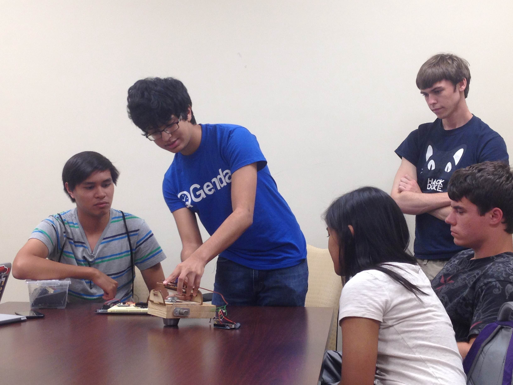
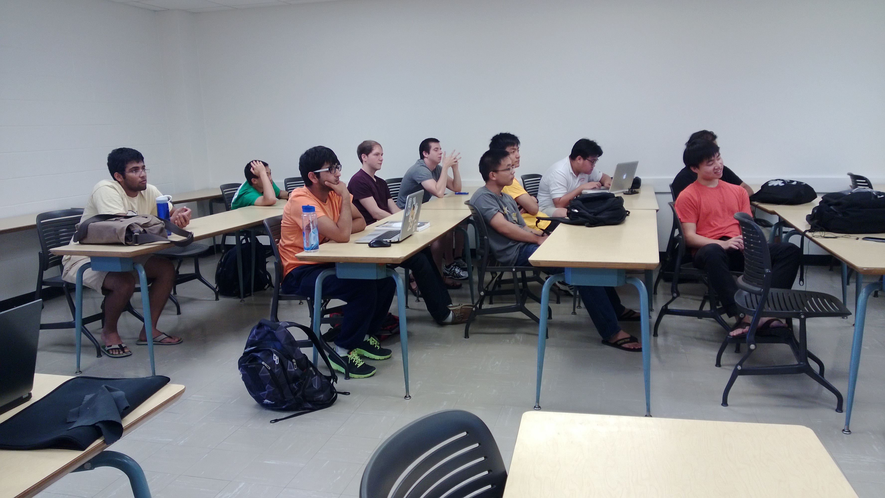
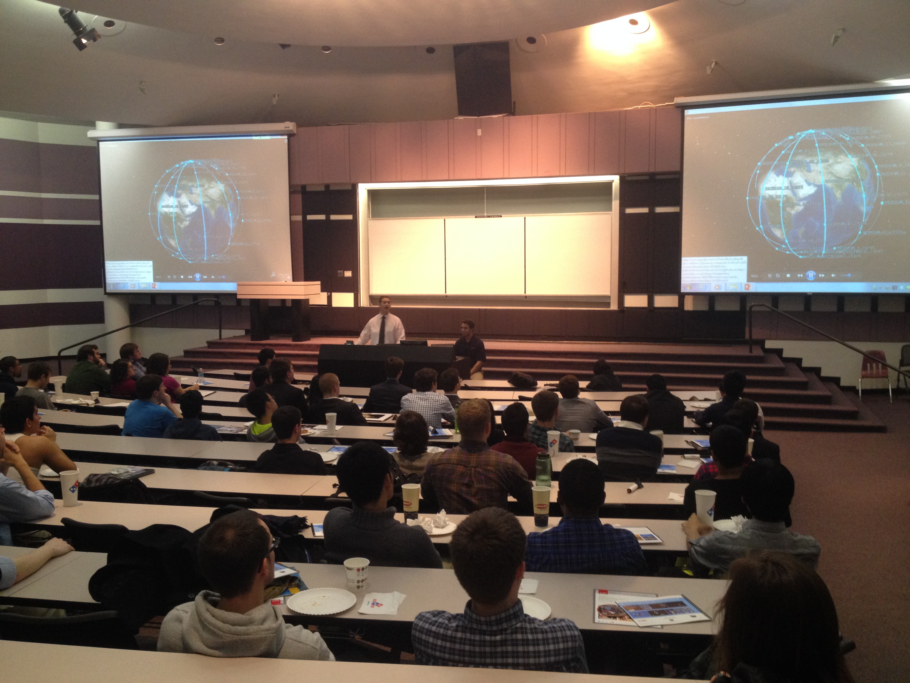
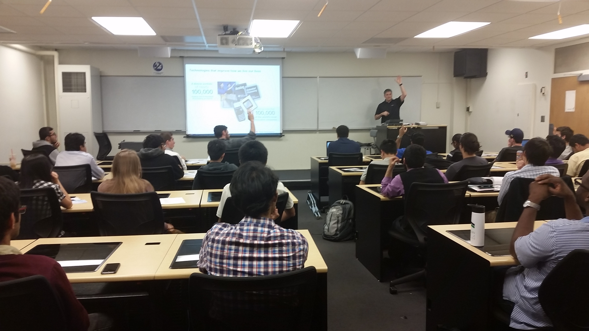
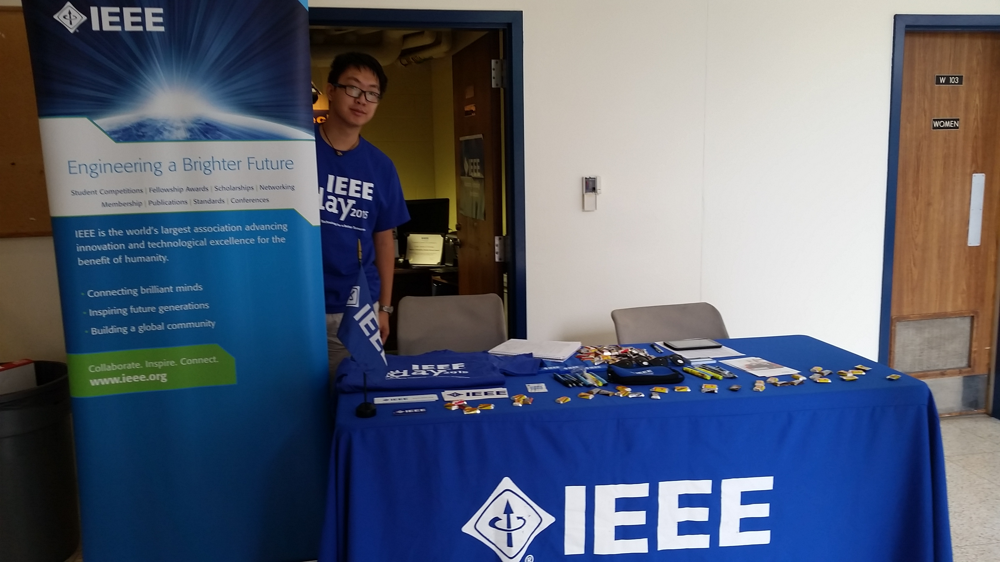
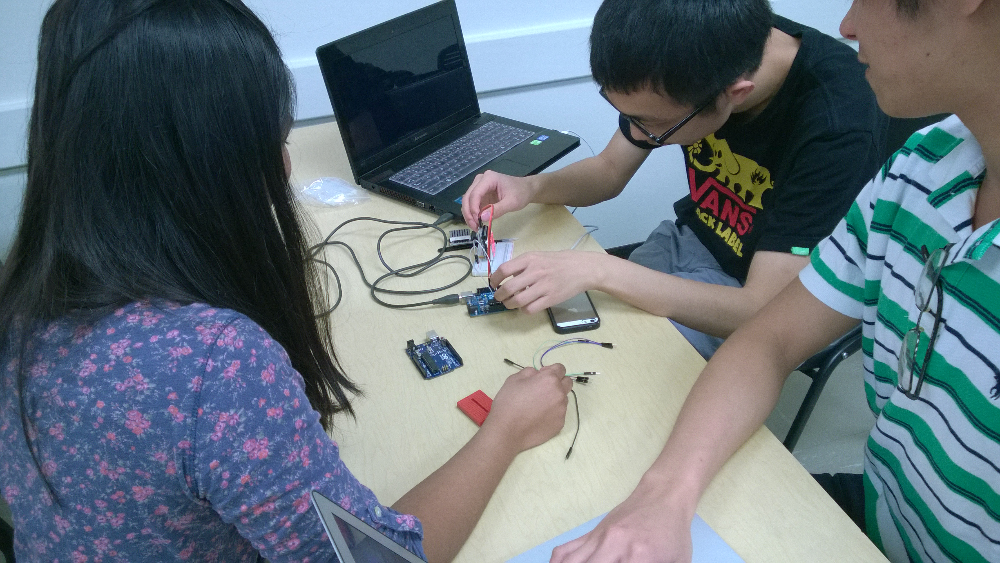
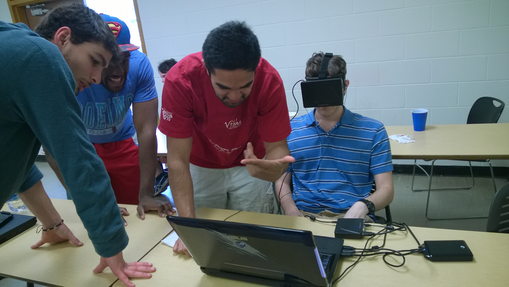



<!-- title: "Welcome to IEEE @ Georgia Tech" -->

  

      

          <ul>
            <li></li>
            <li></li>
            <li></li>
            <li></li>
            <li></li>
            <li></li>
            <li></li>
            <li></li>
            
          </ul>
      

      <a href="#" class="jcarousel-control-prev">&lsaquo;</a>
      <a href="#" class="jcarousel-control-next">&rsaquo;</a>
      
      <!-- 

          
      
 -->
  

##So What's IEEE?
Founded in 1884, The Institute of Electrical and Electronics Engineers is the world's largest technical professional community. IEEE at Georgia Tech is a student branch of National IEEE with over 800 members, making GT IEEE the largest student branch in the nation AND in the <em>western hemisphere</em>. IEEE at Georgia Tech has also been recognized as Outstanding Student Branch of the year and Exemplary Student Branch 4 years running. For a shining future, Georgia Tech IEEE needs you! Don't wait. Join GT IEEE. Your participation shapes the future of GT IEEE.

Learn more [about us](/about.html) and become a [member](/membership.html), or feel free to check out our opportunities in the [Innovation](/innovation.html) and [Hardware](/hardware.html) teams. Don't forget to take advantage of our ECE [tutoring](/tutoring.html) services!

###What Goes On In IEEE?

Here are some of our latest happenings and postings. Be sure to keep up with our newsletter and our Facebook page to keep up to date with all of our events. Our [archives](/archives) pages has more of what you're looking for.

<ul class="posts">
  
    
    <li><a href="{{ BASE_PATH }}{{ post.url }}">{{ post.title }}</a></li>
    
  
</ul>

###Join our Mailing List!

The Georgia Tech IEEE student chapter is very active. We usually have at least one event every week ranging from Proffesor Talks to social events and company info sessions. So make sure to join our weekly [mailing list](http://gt-ieee.us5.list-manage.com/subscribe?u=a42ec30139b77172f44401aa5&id=a4ddfb6da0) in order to keep up with all things Georgia Tech IEEE!

<button type="button" onclick="location.href='https://www.facebook.com/gtieee/';" class="btn btn-primary">Check out our Facebook page!</button>
